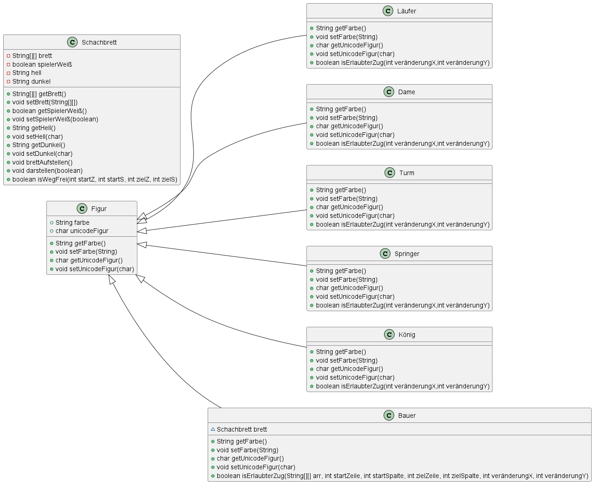

# Aufbau des Brettes
- **Das Spiel findet auf einem 10x10 Brett statt wovon jeweils 1 Reihe oben, unten, rechts und links für die Beschriftung der Felder durch die Koordinaten A-H und 1-8 wegfällt. Somit ist die effektive Spielfläche 8x8 im wechsel Schwarz/Weiß.**

- **Auf dem Brett befinden sich insgesamt 32 Schachfiguren also 16 pro Spieler in den Farben Schwarz und Weiß.**

- **Die Figuren bestehen aus den einzelnen Typen: Bauer, Turm, Springer, Läufer, Dame und König jede Figur mit eigenen Regeln für die Bewegung und das Schlagen anderer Figuren**

- **Es darf sich immer nur eine Figur auf einem Feld befinden**

- **Sobald sich der König auf einem Feld befindet, welches aufgrund der Position der gegnerischen Figuren bedroht ist, aber noch in der lage ist sich zu bewegen ist dies als "Schach" zu werten und der König muss auf ein freies nicht bedrohtes Feld bewegt werden**

- **Wenn sich der König auf einem bedrohtem Feld befindet und sich nicht mehr bewegen kann ist dies ein Schachmatt und das Spiel ist vorbei**

# Spielablauf
- **Spielzüge werden angegeben, indem erst die Koordinaten der zu bewegenden Figur z.B. A2 und dann das Zielfeld A3 genannt werden**

# Codeaufbau
- **Der Code wird Objektorientiert programmiert mit einer Klasse Schachbrett, einer Klasse pro Figurtyp und der Superklasse "Figur"**

# Klassendiagramm

